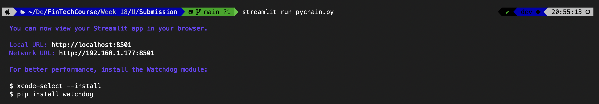
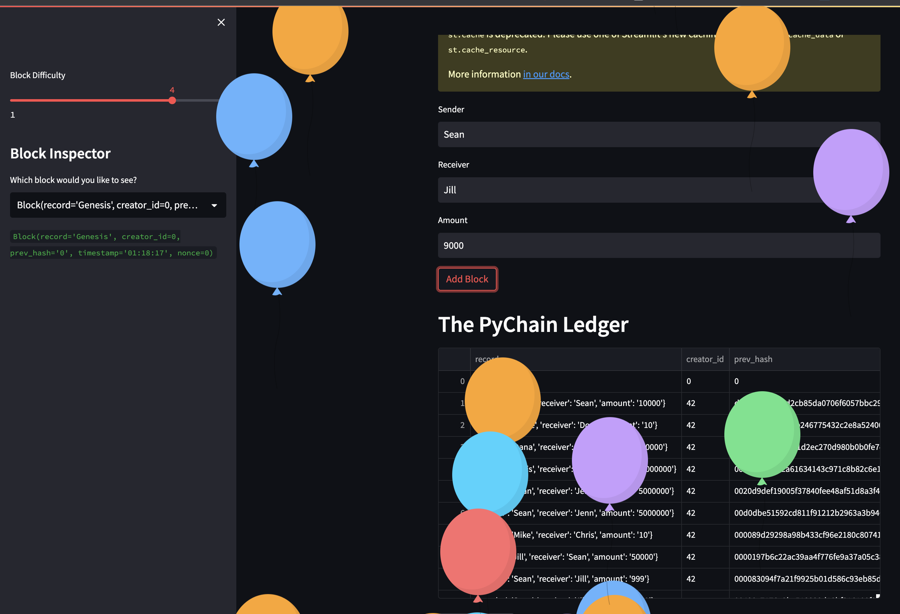
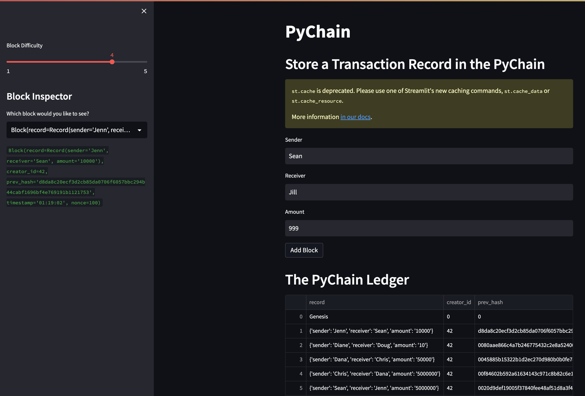
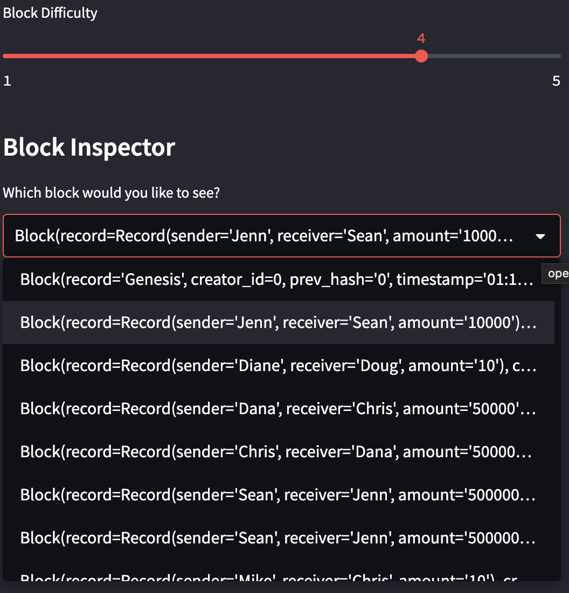
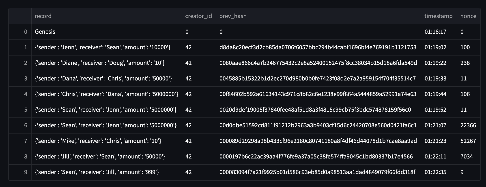
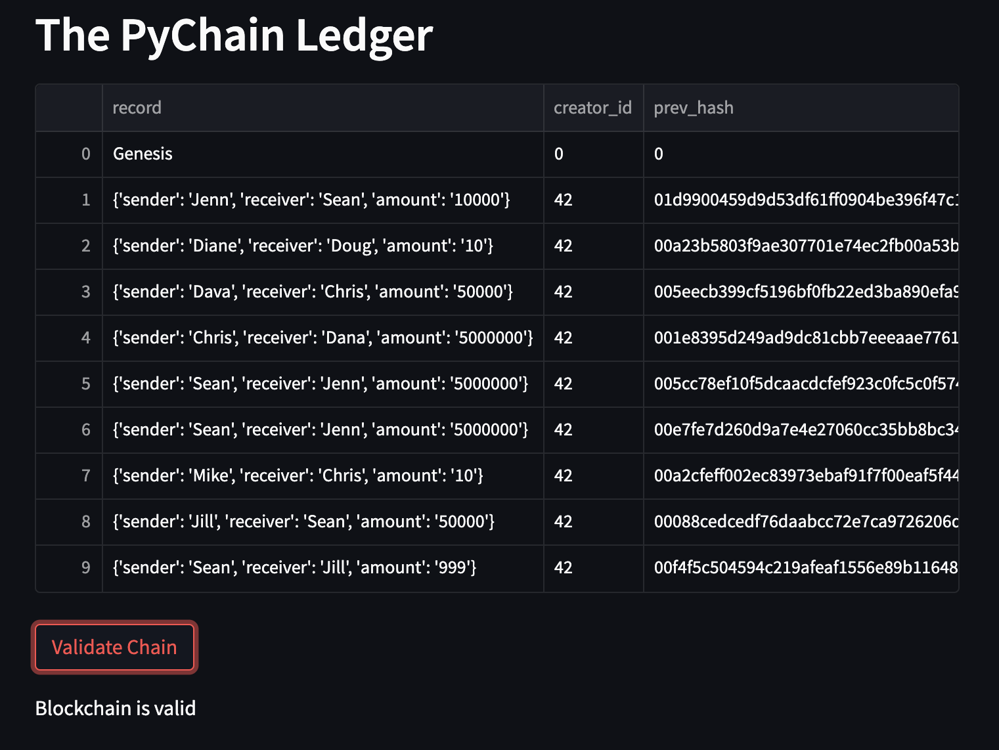

# PyChain Ledger

## Background
You’re a fintech engineer who’s working at one of the five largest banks in the world. You were recently promoted to act as the lead developer on their decentralized finance team. Your task is to build a blockchain-based ledger system, complete with a user-friendly web interface. This ledger should allow partner banks to conduct financial transactions (that is, to transfer money between senders and receivers) and to verify the integrity of the data in the ledger.

## Instructions

Full instructions are contained in the "Instructions.md" file.

## Test the PyChain Ledger by Storing Records

Run the completed `PyChain` ledger and user interface by running the Streamlit application and storing some mined blocks in your `PyChain` ledger. Then test the blockchain validation process by using your `PyChain` ledger. To do so, complete the following steps:

1. In the terminal, navigate to the project folder and run the streamlit application.

2. Enter values for the sender, receiver, and amount, and then click the Add Block button to test the ledger functionality.

3. Verify the block contents and hashes in the Streamlit dropdown menu.

4. Show a copy of the entire Ledger

5. Test the blockchain validation process by using the web interface to ensure the Blockchain is Valid.

